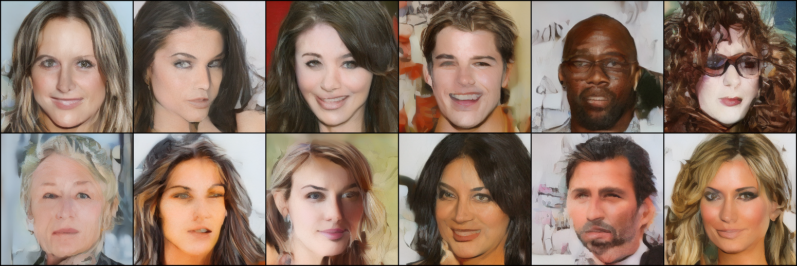

<h1 align="center">Alchemy Lab</h1>
<p align="center"><em>A Diffusion Model Research Framework</em></p>
<p align="center">
  
</p>
<p align="center">
  <a href="https://opensource.org/licenses/Apache-2.0">
    
  </a>
</p>

Alchemy Lab is a modular research infrastructure for building, training, and deploying diffusion models for image generation.

It is designed to:
- Enable fast, configuration-driven experimentation
- Facilitate evaluation, monitoring, and analysis
- Bridge research prototypes and scalable systems

It is not intended to compete with high-level libraries such as those offered by Hugging Face, or vLLM/sglang. Instead, it is closer to a personal research platform.

## Features
- Modular diffusion core
- Composable UNet-style architectures
- Support for latent diffusion
- Configuration-driven experiment management
- Structured training harness with clear separation from model primitives
- Support for distributed training (DDP)

## Repository Structure
Alchemy Lab is organised as a monorepo with three pillars:
- **core** - mathematical primitives and model components
- **lab** - experiment configuration and training infrastructure
- **runtime** - inference and deployment capabilities 

```
src/alchemy/
|-- core/        # diffusion primitives, model components
|-- lab/         # training infrastructure
|-- runtime/     # inference
```

## Installation & Usage
Alchemy Lab may be installed using `uv` after cloning to your local machine:

```bash
git clone https://github.com/j9smith/alchemy-lab
cd alchemy-lab
uv sync
```

#### Training
Once installed, experiments can be parameterised by amending the configuration files found in `lab/configs`, and then executed via the entrypoint `lab/cli/train.py`:
```bash
cd alchemy-lab/src/alchemy/lab/cli
uv run python train.py
```

Example config file:
```yaml
defaults:
  - model: unet2d
  - vae: sd_vae_ft_mse
  - data: celeba_256
  - optim: adamw
  - loss: eps_linear
  - logging: default
  - checkpoints: default

train:
  resume: "checkpoint.pt"
  precision: fp32
  max_steps: 50000
  lr: 0.0002
  ema_decay: 0.9999
  log_dir: "./log_dir/"
  experiment_name: "default"
  save_every_n_steps: 5000
  save_path: "./weights/"
  save_prefix: "unet"

dist:
  backend: nccl
```

#### Sampling
Images can be sampled by loading saved checkpoints via the `cli/sample.py` script:
```bash
uv run python sample.py --ckpt ./weights/unet_stepXXX.pt --device cuda --use_ema --n 24
```
Sampled images are stored in `output/samples.png`.

<p align="center">
  
</p>

#### Profiling
Training can be profiled by leveraging in-code NVTX annotations to produce NVIDIA Nsight Systems reports. This can be achieved by loading the dedicated profiling script `lab/cli/profiling.py` under `nsys` ([ensure that `nsys` is installed](https://developer.nvidia.com/nsight-systems/get-started)):
```bash
nsys profile \
  --output ~/reports/alchemy_$(date +%Y%m%d_%H%M%S) \
  --trace cuda,nvtx,osrt,cublas,cudnn \
  --capture-range cudaProfilerApi \
  --capture-range-end stop \
  --stats true \
  --gpu-metrics-devices all \
  uv run python profiling.py
```

## Alchemy Runtime
Alchemy Lab also includes a lightweight inference server implemented in C++ using [TensorRT](https://developer.nvidia.com/tensorrt) for accelerated GPU inference. 

#### Prerequisites
- NVIDIA GPU with TensorRT installed
- Docker with [NVIDIA Container Toolkit](https://docs.nvidia.com/datacenter/cloud-native/container-toolkit/latest/install-guide.html)
- ONNX model files exported from a trained checkpoint via `lab/cli/export.py`
- TensorRT `.plan` files converted from the exported ONNX models via `trtexec`

#### Export & Conversion
Firstly, a trained checkpoint must be exported to ONNX. The following will export both the denoiser and (if specified) the decoder loaded in config:
```bash
cd src/alchemy/lab/cli
uv run python export.py --ckpt ./weights/unet_stepXXX.pt --use_ema
```

Then convert to TensorRT plans (must be run on the target GPU inside the runtime container; adjust shapes as necessary):
```bash
trtexec --onnx=denoiser.onnx --saveEngine=denoiser.plan \
  --minShapes=xt:1x4x32x32,t:1 --optShapes=xt:4x4x32x32,t:4 --maxShapes=xt:8x4x32x32,t:8

trtexec --onnx=decoder.onnx --saveEngine=decoder.plan \
  --minShapes=latent:1x4x32x32 --optShapes=latent:4x4x32x32 --maxShapes=latent:8x4x32x32
```

#### Running
Start the dev container from `src/alchemy/runtime/`:
```bash
docker compose up -d
docker compose exec api bash
```

Build and launch the server:
```bash
cd build
cmake --build .
./alchemy-runtime
```

To generate an image while the server is running, from another terminal:
```bash
curl -X POST http://localhost:8000/generate -o output.ppm
xdg-open output.ppm
```

## Roadmap
Alchemy Lab is very much a work in progress. Planned extensions include:
- DiT architecture
- Mixed precision training
- Distributed training (FSDP)
- Performance enhancements
- ~~ONNX export~~
- ~~Generic deployment infrastructure~~
